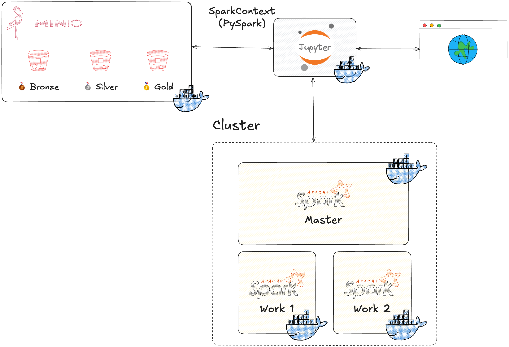

# Simple DataLake

<p align="center">
    <br><br>
</p>

## 📖 About

This project contains the construction of a simple Data Lake for data storage and analysis, using containers to orchestrate the services. The functional architecture is based on docker-compose, which involves a Spark cluster, an object repository with MinIO, a notebook layer with JupyterLab and an ETL for ingesting NASA climate data. The architecture follows the medallion model (bronze, silver, gold), with a focus on scalability and reproducibility.

------------
## 🧪 Technology

The project was developed with:

&rarr; <a href="https://www.python.org" target="_blank">Python</a> <br>
&rarr; <a href="https://spark.apache.org" target="_blank">Apache Spark</a> <br>
&rarr; <a href="https://min.io" target="_blank">MinIO</a> <br>
&rarr; <a href="https://www.docker.com" target="_blank">Docker</a> <br>

------------
## 🔖 Proposed solution 

### 🏗️ Proposed architecture

<br><br>

### 📁 Project structure

```
projeto_2/
├── docker/
│   ├── Dockerfile
|   └── requirements.txt
├── notebooks/
│   ├── analise-pnad.ipynby                
│   ├── etl.ipynb                
│   ├── hello-world.ipynb                
│   └── minio.ipynb
├── .env                  
├── docker-compose.yml               
└── README.md                      
```
